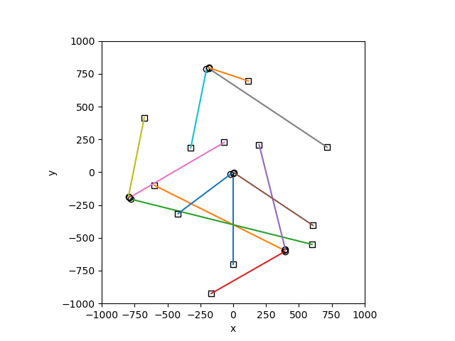
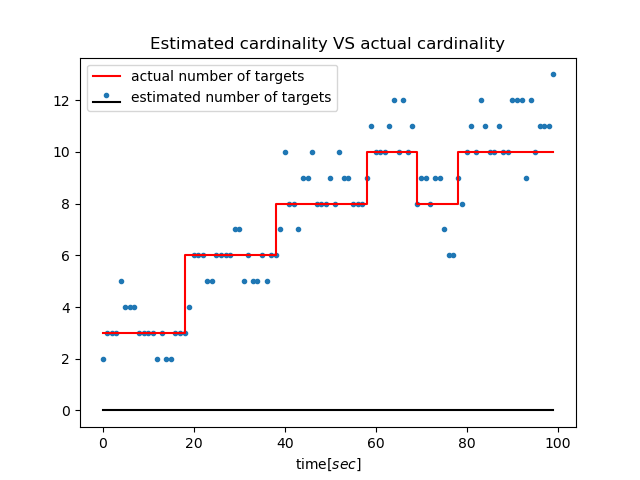
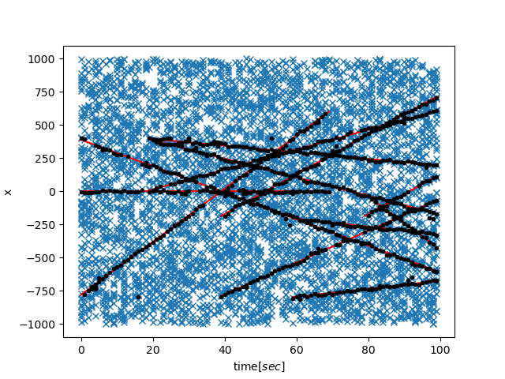
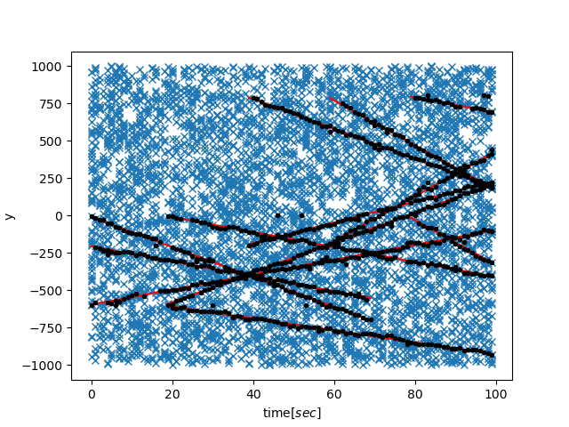
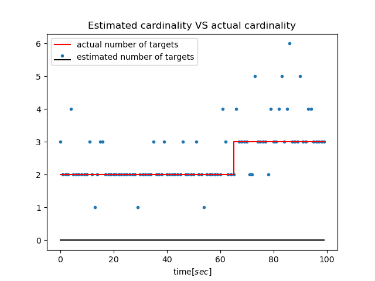
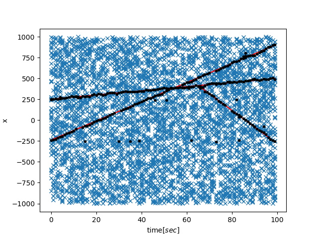
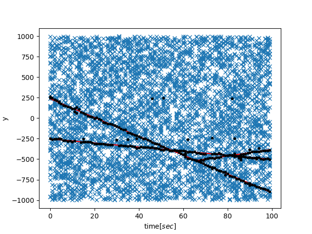
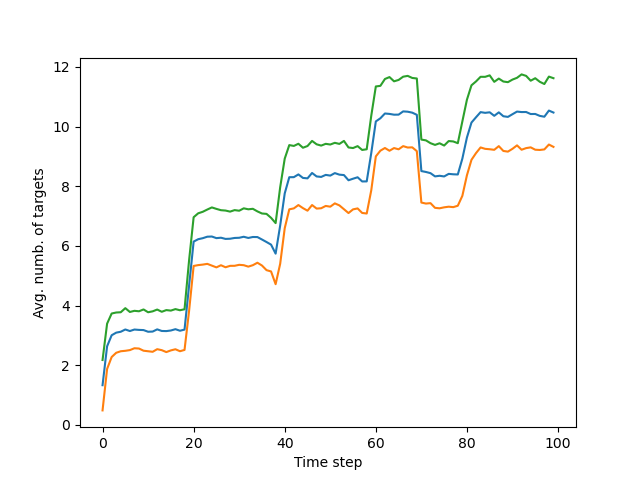
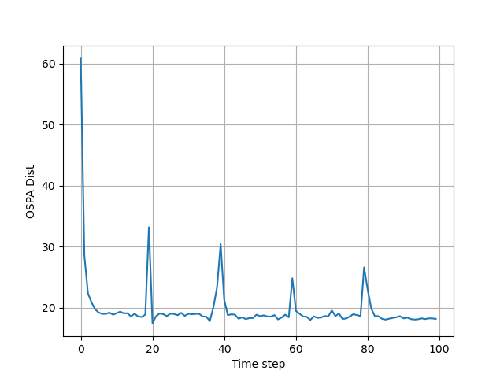
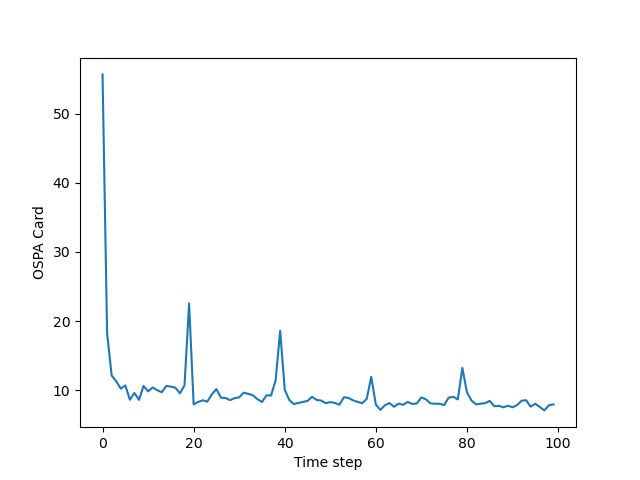

# The Gaussian Mixture Probability Hypothesis Density filter. Python implementation
**It's based on "The Gaussian mixture probability hypothesis density filter" by Vo and Ma. Also, OSPA metric is provided for 
performance evaulation.**

The file [examples.py](examples.py) contains two simulation examples. 

### Example 1
The first is actually a replica of the example in "Bayesian Multiple 
Target Filtering Using Random Finite Sets" by Vo, Vo, Clark used for performance evaulation of GMPHD filter. Targets lifes
 are based on Matlab code provided by Vo in http://ba-tuong.vo-au.com/codes.html and example doesn't contain target spawning.

 <table>
  <tr>
    <td valign="top"></td>
    <td valign="top"></td>
  </tr>
  <tr>
    <td valign="top"></td>
    <td valign="top"></td>
  </tr>
 </table>
 
### Example 2
The second example is based on the simulation example in "The Gaussian mixture probability hypothesis density filter" by Vo and Ma. Also, 
this example demonstrates the spawning situation.

 <table>
  <tr>
    <td valign="top"></td>
    <td valign="top"></td>
  </tr>
  <tr>
    <td valign="top"></td>
    <td valign="top"></td>
  </tr>
 </table>

## Simulation process and usage

The simulation steps are the following:
* Define the details of the process model:
```python
    model = process_model_for_example_1()
```
* Create the objects for description of the targets birth timestamps, death timestamps and starting positions. Then generate 
  trajectories based on the model and the given targets life description:
```python
    targets_birth_time, targets_death_time, targets_start = example1(model['num_scans'])
    trajectories, targets_tracks = generate_trajectories(model, targets_birth_time, targets_death_time, targets_start,
                                                         noise=False)
```
In the provided two simulation examples, targets are moving with the constant velocity, but we can make them move randomly in the
observation area by setting the `noise` parameter true.
* Generate measurements based on the target trajectories. Because in real situations the sensor observations are noisy, in
  this step we just add the measurement noise for simulation purposes:
```python
    data = generate_measurements(model, trajectories)
```

The `data` is list of collections of observations in each time step. For real filtering process, this will be the 
input from our sensors.
*  Filter the measurement data with GMPHD filter. Filter also needs to know assumed process model, which is provided by
   creation of the filter object.
```python
    gmphd = GmphdFilter(model)
    X_collection = gmphd.filter_data(data)
```
###
All about the creation of the simulation process and running examples is in [examples.py](examples.py) file. To switch between the two
examples, just toggle comments at the beggining of the main function. 

## Monte Carlo simulations
To measure the performance of the GMPHD filter, the averaged OSPA metric is used from "A consistent metric for performance evaluation
of multi-object filters", by D. Schuhmacher, B.-T. Vo, and B.-N. Vo.

in [monte_carlo_simulations_and_plots_of_results.py](monte_carlo_simulations_and_plots_of_results.py) you can run 
Monte Corle simulations, which is implemented in `MC_run()` function. These simulations can last quite long, and that is
why the result is saved in .pkl file. I have provided one such file with averaged 1000 MC simulations in
MC2ospatnum1000.pkl file, and you can plot it's result also in this file.

You can toggle between simulation and plotting the results just with commenting out the appropriate section.

 <table>
  <tr>
    <td valign="top"></td>
    <td valign="top"></td>
  </tr>
  <tr>
    <td valign="top"></td>
    <td valign="top"></td>
  </tr>
 </table>
<!--


-->
